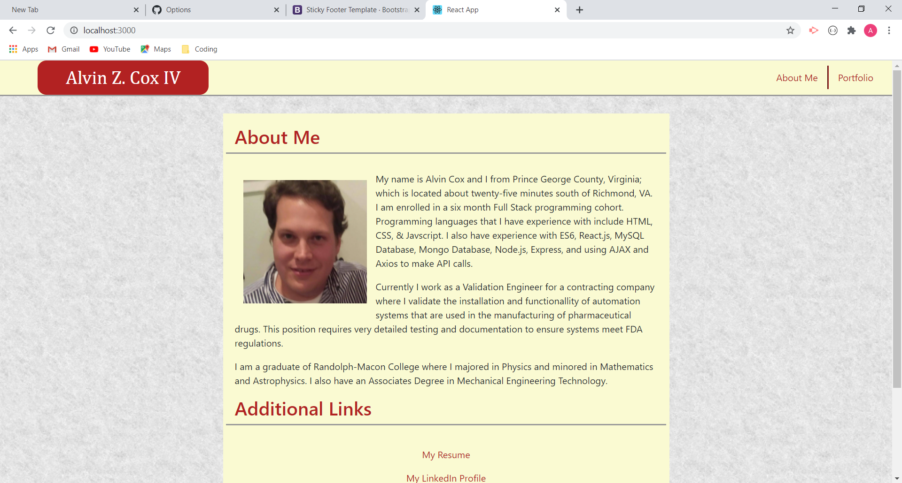

# Responsive Portfolio

  The Responsive Portfolio is used showcase applications that I have written as well as to give some background about myself.

  

  ***

  ## Table of Contents:

  1. [How to Install Responsive Portfolio](#Installation)
  2. [Using Responsive Portfolio](#How%20To%20Use%20This%20Application)
  3. [Testing Responsive Portfolio](#Test%20Code)
  4. [Contribution Guidlines](#Contribution%20Guidelines)
  5. [Ask Us Questions](#Ask%20Questions)
  6. [Licenses](#License)

  ***

  ## Installation

  Navigate your browser to 

  ## How to Use This Application

  The About Me page contains a short summary about my professional experience as well as some extrnal links to my GitHib and LinkedIn Profiles as well as a link to my Resume and a link to send me an e-mail. This application is mobile responsive.

  

  ## Test Code

  No test were used in the creation of this application

  ## Contribution Guidelines

  This application is describes my own professional experience and thus there should be no outside contributions.

  ## Ask Questions

  Visit my GitHub Page: [My GitHub Profile Page](https://github.com/AlvinZC4)
 -OR-
 Drop me an e-mail at: alvinzcoxiv@gmail.com

  ## License

  This applicaton is covered under the MIT License

